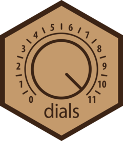

<!-- README.md is generated from README.Rmd. Please edit that file -->

```{r setup, include = FALSE}
knitr::opts_chunk$set(
  collapse = TRUE,
  comment = "#>",
  fig.path = "man/figures/README-",
  out.width = "100%"
)
```

# dials <a href="https://dials.tidymodels.org/"></a>

<!-- badges: start -->
[](https://github.com/tidymodels/dials/actions/workflows/R-CMD-check.yaml)
[](https://app.codecov.io/gh/tidymodels/dials)
[](https://CRAN.R-project.org/package=dials)
[](https://CRAN.R-project.org/package=dials)
[](https://lifecycle.r-lib.org/articles/stages.html)
[](https://github.com/tidymodels/dials/actions/workflows/R-CMD-check-hard.yaml)

<!-- badges: end -->

## Overview

This package contains _infrastructure_ to create and manage values of tuning parameters for the tidymodels packages. If you are looking for _how to_ tune parameters in tidymodels, please look at the [tune](https://tune.tidymodels.org/) package and [tidymodels.org](https://www.tidymodels.org/). 

The name reflects the idea that tuning predictive models can be like turning a set of dials on a complex machine under duress. 


## Installation

You can install the released version of dials from [CRAN](https://CRAN.R-project.org) with:

```{r}
#| eval: false
install.packages("dials")
```

You can install the development version from Github with:

```{r}
#| eval: false
# install.packages("pak")
pak::pak("tidymodels/dials")
```

## Contributing

Please note that the dials project is released with a [Contributor Code of Conduct](https://dials.tidymodels.org/CODE_OF_CONDUCT.html). By contributing to this project, you agree to abide by its terms.

- For questions and discussions about tidymodels packages, modeling, and machine learning, please [post on Posit Community](https://forum.posit.co/new-topic?category_id=15&tags=tidymodels,question).

- If you think you have encountered a bug, please [submit an issue](https://github.com/tidymodels/dials/issues).

- Either way, learn how to create and share a [reprex](https://reprex.tidyverse.org/articles/articles/learn-reprex.html) (a minimal, reproducible example), to clearly communicate about your code.

- Check out further details on [contributing guidelines for tidymodels packages](https://www.tidymodels.org/contribute/) and [how to get help](https://www.tidymodels.org/help/).

